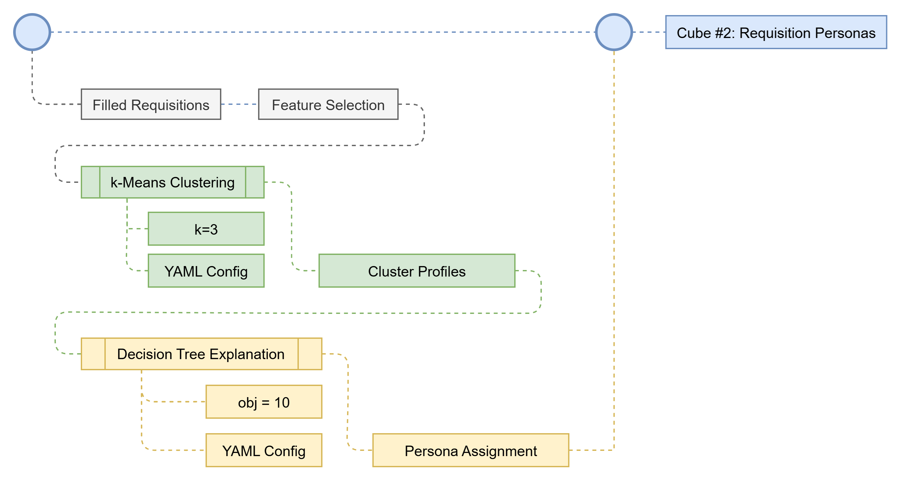

## Cube #2: Requisition Personas

One cube. One job. That's it. Discover the Personas of Filled Requisitions.

### The Two Inputs

<Steps>
  <Step title="Input: Filled Requisitions">
    Filled Requisitions
  </Step>
  <Step title="TA Context: Column Selection">
    The recruiting signals we chose to evaluate for persona building.
  </Step>
</Steps>

### The Model

<AccordionGroup>
  <Accordion title="Filled Requisitions">
    The historical recruiting activity the cube learns from.
  </Accordion>

  <Accordion title="Model 1: k-Means Clustering">
    The recurring workload patterns hidden inside the recruiting data.
  </Accordion>

  <Accordion title="Cluster Profiles">
    The operational groupings discovered by the model.
  </Accordion>

  <Accordion title="Model 2: Decision Tree Explanation">
    The strongest signals separating the workload groupings.
  </Accordion>

  <Accordion title="Persona Assignment">
    The explainable workload identities produced by the cube.
  </Accordion>
</AccordionGroup>

### The Three Outputs

<Steps>
  <Step title="Data" stepNumber={3}>
    The analytic outputs consumed by the next cube.
  </Step>
  <Step title="Decision" stepNumber={4}>
    Requisition Personas
  </Step>
  <Step title="Explainability" stepNumber={5}>
    Why the requisition was grouped into its persona.
  </Step>
</Steps>